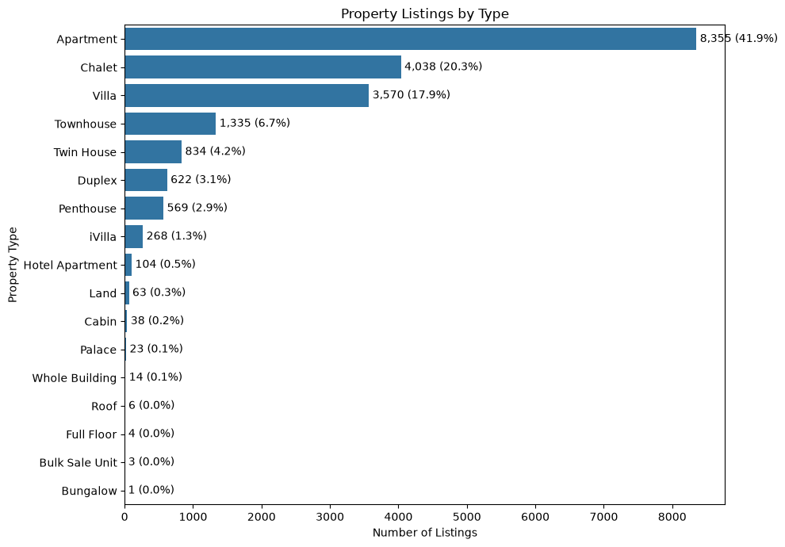
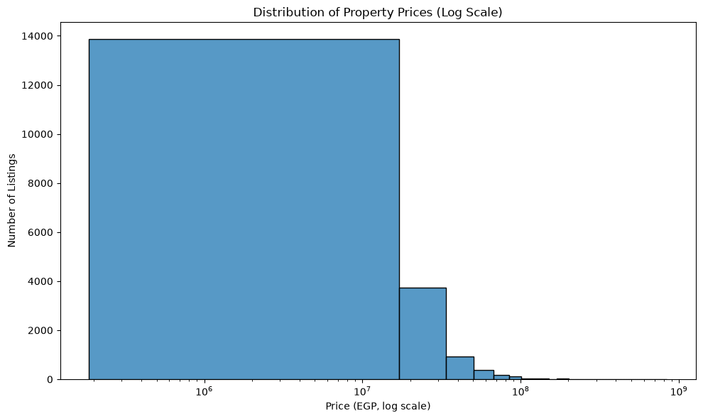
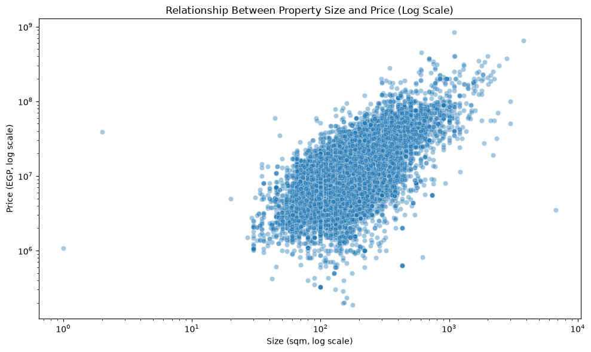
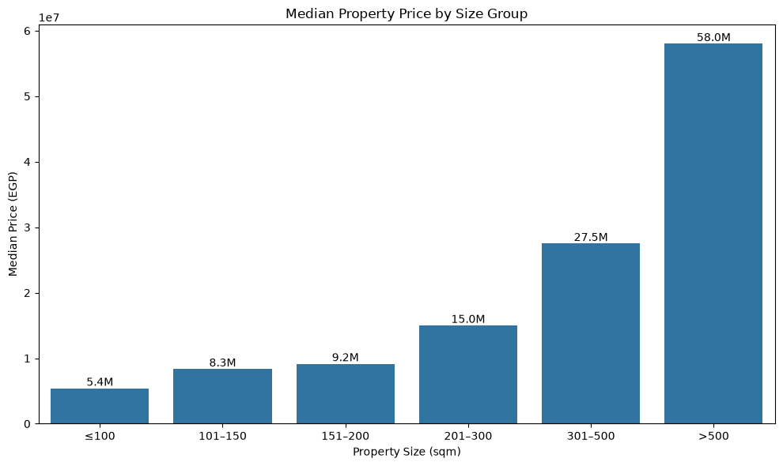
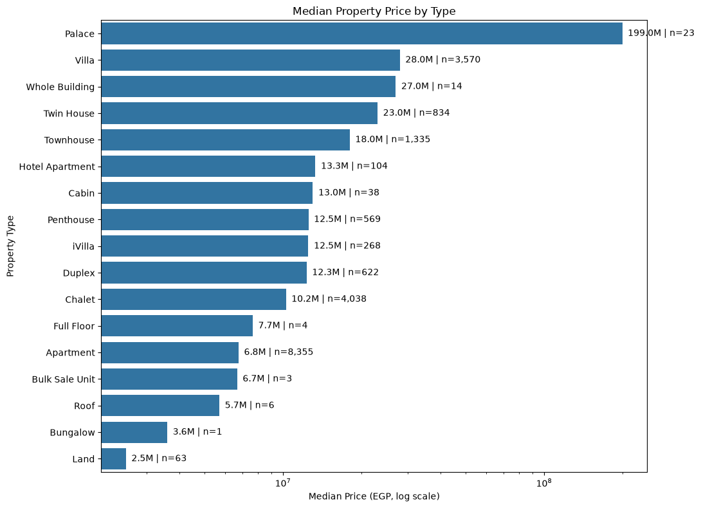

# Egyptian Real Estate Market Analysis 

## Project Overview

This project analyzes Egyptian real estate listings to understand property distributions, pricing trends, size correlations, and market valuations. 
The project includes data downloading, robust data cleaning, exploratory data analysis (EDA), statistical metrics, and visual insights.

## Dataset

- **Source:** Kaggle (`hassankhaled21/egyptian-real-estate-listings`)
- **Dataset Focus:** Property types, prices, sizes in square meters, bedrooms, bathrooms, locations, and down payments.

## Project Structure

```text
Egyptian-Real-Estate-Analysis/
│
├── Egyptian_Real_Estate_Analysis.ipynb
├── download_data.py
├── README.md
└── visualizations/
    ├── output1.png
    ├── output2.png
    ├── output3.png
    ├── output4.png
    ├── output5.png
    ├── output6.png
    └── output7.png

## Data Cleaning & Preprocessing

The cleaning and preprocessing workflow included:

Checking missing values and calculating missing percentages across columns.
Cleaning the price column by removing commas and converting it to numeric data type (price_clean).
Handling outliers in prices using Interquartile Range (IQR) bounds.
Extracting numeric values for property sizes (size_sqm) from text using regular expressions.
Handling exceptional property size records (such as cleaning invalid land/property size entries).
Extracting numeric counts for bedrooms and bathrooms.
Converting availability dates to datetime objects and analyzing down payment ratios.

## Exploratory Data Analysis & Visualizations
The analysis covers:
Property Listings by Type: Examining the distribution and market share of various property types (e.g., Apartments, Villas, Chalets, Lands).
Distribution of Property Prices: Visualizing pricing using log scale histograms to handle right-skewed data distributions.
Size vs. Price Relationship: Exploring how property sizes correlate with prices using scatter plots and log-scale transformations.
Median Price by Size Group: Categorizing property sizes into groups (≤100 sqm up to >500 sqm) and analyzing median price scaling.
Median Property Price by Type: Comparing property types based on their median market prices and listing counts.

## Key Visualizations

### 1. Property Listings by Type
<p align="center">
  
</p>

### 2. Distribution of Property Prices
<p align="center">
  
</p>

### 3. Relationship Between Property Size and Price
<p align="center">
  
</p>

### 4. Median Property Price by Size Group
<p align="center">
  
</p>

### 5. Median Property Price by Type
<p align="center">
  
</p>

## Key Business Insights
Property prices are strongly right-skewed, with most listings concentrated at lower price levels while a smaller number of high-value properties extend toward very high valuations.
Median property prices generally increase as property size increases, rising significantly from lower size brackets up to properties larger than 500 sqm.
Property types vary significantly in both volume and median market valuation across the Egyptian real estate market.

## Technologies Used
Python 
Pandas & NumPy (Data Cleaning & Manipulation)
Matplotlib & Seaborn (Data Visualization)
Kagglehub (Dataset Retrieval)
Visual Studio Code & Jupyter Notebook
